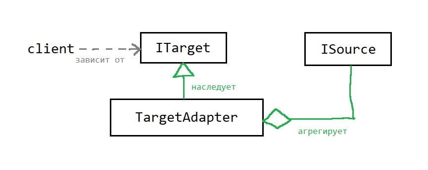

# Занятие 1: Наследование, реализация интерфейсов, шаблон проектирования "адаптер"

## Теория

### Адаптер (Adapter)



Адаптер - шаблон проектирования который позволяет использовать объекты имеющие интерфейс ISource в местах программы которые
реализованы для интерфейса ITarget. Простыми словами, если вам надо воткнуть USB-A в USB-C дырку, вам необходим
переходник (адаптер) который приведет один интерфейс к другому.

Вот так может выглядеть реализация того, что изображено на UML диаграмме:

```
// интерфейс (это наш ITarget)

public interface ILogger
{
    void Info( String message );
    void Error( String message );
}

// клиентский код (client), некий алгоритм, который зависит только от ILogger

void MegaAlgorithm( ILogger log )
{
    // бац
    log.Info( "Сделал бац" );
    // тац
    log.Error( "А вот тац не получилось" );
}

// предположим у нас есть интерфейс для некой абстрактной консоли (это наш ISource)

public interface IConsole
{
    void SetColor( Int32 foreground, Int32 backgroung );
    void Print( String text );
}

// и теперь мы хотим сделать так чтобы наш клиентский код что-то залогировал на консоль,
// для этого пишем адаптер

public class ConsoleToLoggerAdapter: ILogger
{
    private IConsole _console;

    public ConsoleToLoggerAdapter( IConsole console )
    {
        if( _console is null )
            throw new Exception( "console is null" );

        _console = console;
    }

    public void Info( String message )
    {
        _console.Print( $"INFO: {message}\n" );
    }

    public void Error( String message )
    {
        _console.Print( $"ERROR: {message}\n" );
    }
}

// предположим, у нас есть StandardConsole, который реализует интерфейс IConsole,

public class StandardConsole: IConsole
{
    public void SetColor( Int32 foreground, Int32 backgroung )
    {
        // тут реализация, не буду писать, долго :D
    }

    public void Print( String text )
    {
        Console.Write( text );
    }
}


// где-то у нас используется такой объект (совсем не обязательно в этом месте объявленный)
StandardConsole console = new();

// вызываем клиентский код
MegaAlgorithm( new ConsoleToLoggerAdapter( console ) );

// таким образом мы привели IConsole к ILogger

```

### Ссылки

[Индексаторы](https://learn.microsoft.com/ru-ru/dotnet/csharp/programming-guide/indexers/)

Пример объявления индексатора (представим комплексное число в виде вектора из двух элементов):

```
public class Complex
{
    public Double Real { get; set; }
    public Double Image { get; set; }

    // Индексатор
    public Double this[Int32 index]
    {
        get
        {
            if( index == 0 )
                return Real;

            if( index == 1 )
                return Image;

            throw new Exception( "Index out of a range." );
        }
        set
        {
            if( index == 0 )
                Real = value;
            else if( index == 1 )
                Image = value;
            else
                throw new Exception( "Index out of a range." );
        }
    }

    public Complex( Double real, Double image )
    {
        Real = real;
        Image = image;
    }
}
```

Имея класс с таким индексатором, к его данным можно обращаться следующим образом:

```
Complex x = new Complex( 1.0, 2.0 );
x.Real = 3.0;
x.Image = 4.0;
x[0] = x[1];
x[-1] = 1;
```

В общем случае у индексатора может быть несколько параметров и они могут быть любого типа.
В данном случае это Int32, но можно и String например использовать, или вообще
любой класс в качестве ключа.

Индексатор позволяет использовать синтаксис работы с массивами для произвольных классов.

Другими словами реализация индексатора эквивалентна перегрузке оператора [] для класса.

## Задачи данной работы

1. Реализовать класс Complex
2. Реализовать класс Matrix
3. Реализовать методы в классах SComplex и SMatrix
4. Реализовать класс ComplexToMatrixAdapter
5. Реализовать класс MatrixToComplexAdapter

## Требования

1. Все классы должны быть хорошо инкапсулированы, т.е. должны следить за своим состоянием и не допускать его некорректности.
2. Все классы должны быть размещены в своих одноименных файлах.
3. Классы Complex и Matrix должны быть иммутабельными (это упростит вам задачу).
4. Классы адаптеры должны агрегировать исходный объект и использовать его публичный интерфейс для реализации целевого интерфейса. Т.к. классы мы делаем иммутабельными все проверки на допустимость создания адаптера выполняем в его конструкторе.
5. Файл Tests.cs изменять запрещено, если хотите написать дополнительные тесты делайте это в файле PersonalTests.cs.

## Оценка

В данной работе 5 тестов, за каждый пройденный тест по баллу.

